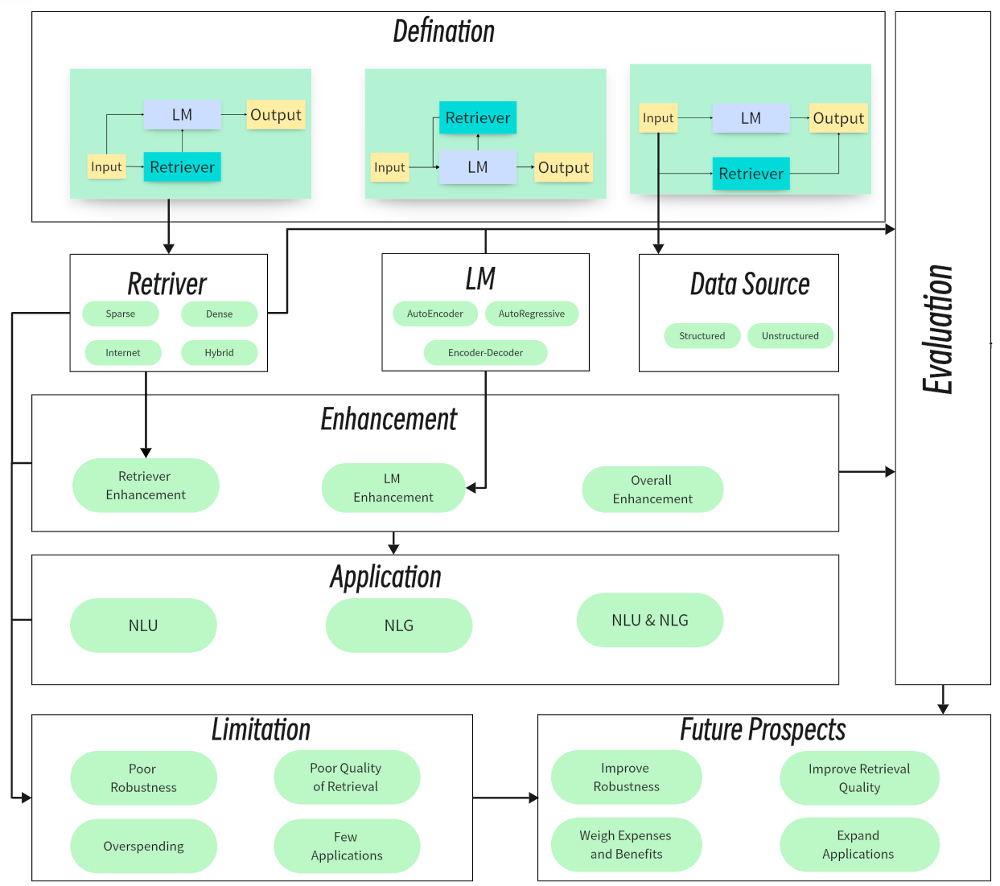

# RALM_Survey
This is a repository of RALM surveys containing a summary of state-of-the-art RAG and other technologies according to according to our survey paper: [From Intuition to Rationality: A Survey on Retrieval-augmented Language Model in Natural Language Processing]() . In this repository, we will present the most central research approach of our thesis as well as keep up-to-date with work on RALM in the most accessible way possible. For more detailed information, please read our papers. Please cite our papers if you think they can help you with your research!
```


```


## News
This project is under development. You can hit the **STAR** and **WATCH** to follow the updates.
* Our survey：[From Intuition to Rationality: A Survey on Retrieval-augmented Language Model in Natural Language Processing]() on RALM is now public.

## Table of Contents
- [RALM_Survey](#ralm_survey)
  - [News](#news)
  - [Overview](#overview)
  - [Table of Contents](#table-of-contents)
  - [Related Surveys](#related-surveys)
  - [Defination](#defination)
    - [Sequential Single Interaction](#sequential-single-interaction)
    - [Sequential Multiple Interactions](#sequential-multiple-interactions)
    - [Parallel Interaction](#parallel-interaction)
  - [Retriever](#llm-augmented-kgs)
    - [Sparse Retrieval](#spars-retrieval)
    - [Dense Retrieval](#dense-retrieval)
    - [Internet Retrieval](#internet-retrieval)
    - [Hybrid Retrieval](#hybrid-retrieval)
  - [Language Models](#language-models)
    - [AutoEncoder Language Model](#autoencoder-language-model)
    - [AutoRegressive Language Model](#autoregressive-language-model)
    - [Encoder-Decoder Language Model](#encoder-decoder-language-model)
  - [RALM Enhancement](#ralm-enhancement)
    - [Retriever Enhancement](#retriever-enhancement)
    - [LM Enhancement](#lm-enhancement)
    - [Overall Enhancement](#overall-enhancement)
  - [Data Source](#data-source)
    - [Structured Data](#structured-data)
    - [Unstructured data](#unstructured-data)
  - [Applications](#applications)
    - [RALM on NLG](#ralm-on-nlg)
    - [RALM on NLU](#ralm-on-nlu)
    - [{RALM on Both NLU and NLG](#{ralm-on-both-nlu-and-nlu)
  - [Evaluation](#evaluation)
  
## Overview
This SURVEY of ours summarizes multiple aspects of RALM, including: definition, retriever, LM, enhancement, data source, application, evaluation, and more.
*We hope this repository can help researchers and practitioners to get a better understanding of RALM.
*

## Related Surveys
Retrieval-Augmented Generation for AI-Generated Content: A Survey(Arxiv, 2024)[[paper]](https://arxiv.org/pdf/2402.19473.pdf)


