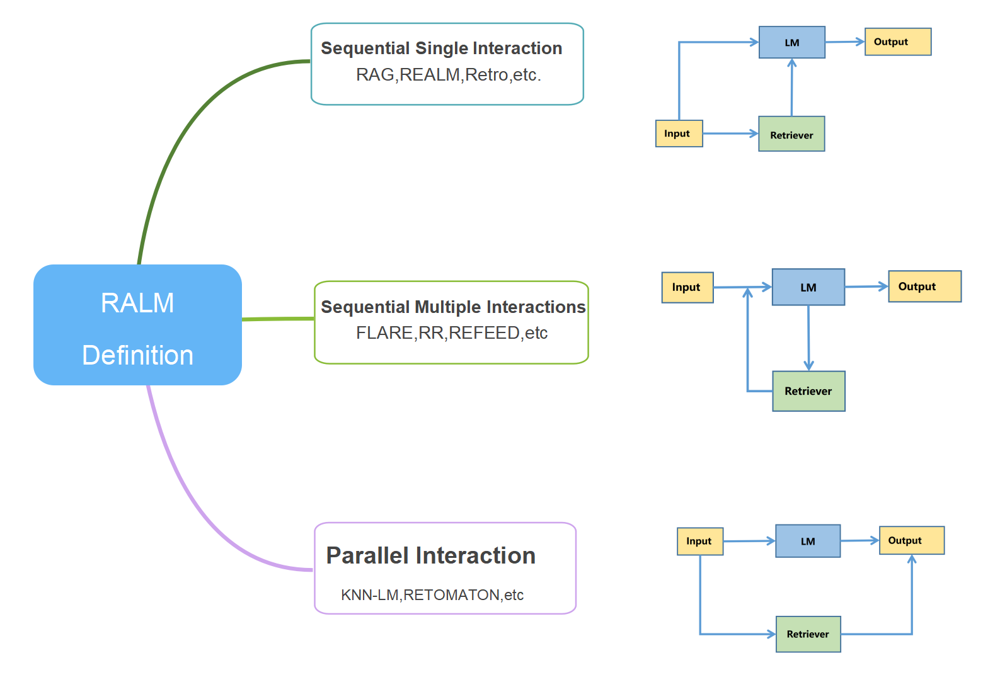
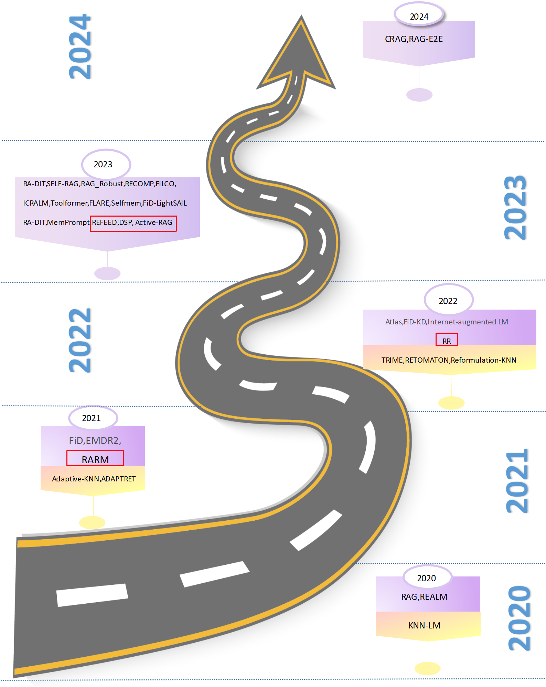
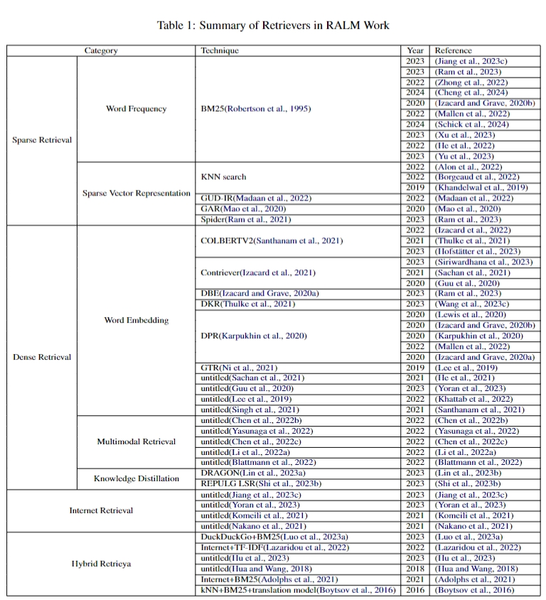

# RALM_Survey
This is a repository of RALM surveys containing a summary of state-of-the-art RAG and other technologies according to according to our survey paper: [From Intuition to Rationality: A Survey on Retrieval-augmented Language Model in Natural Language Processing]() . In this repository, we will present the most central research approach of our thesis as well as keep up-to-date with work on RALM in the most accessible way possible. For more detailed information, please read our papers. Please cite our papers if you think they can help you with your research!
```


```


## News
This project is under development. You can hit the **STAR** and **WATCH** to follow the updates.
* Our survey：[From Intuition to Rationality: A Survey on Retrieval-augmented Language Model in Natural Language Processing]() on RALM is now public.

## Table of Contents
- [RALM_Survey](#ralm_survey)
  - [News](#news)
  - [Overview](#overview)
  - [Table of Contents](#table-of-contents)
  - [Related Surveys](#related-surveys)
  - [Defination](#defination)
    - [Sequential Single Interaction](#sequential-single-interaction)
    - [Sequential Multiple Interactions](#sequential-multiple-interactions)
    - [Parallel Interaction](#parallel-interaction)
  - [Retriever](#llm-augmented-kgs)
    - [Sparse Retrieval](#spars-retrieval)
    - [Dense Retrieval](#dense-retrieval)
    - [Internet Retrieval](#internet-retrieval)
    - [Hybrid Retrieval](#hybrid-retrieval)
  - [Language Models](#language-models)
    - [AutoEncoder Language Model](#autoencoder-language-model)
    - [AutoRegressive Language Model](#autoregressive-language-model)
    - [Encoder-Decoder Language Model](#encoder-decoder-language-model)
  - [RALM Enhancement](#ralm-enhancement)
    - [Retriever Enhancement](#retriever-enhancement)
    - [LM Enhancement](#lm-enhancement)
    - [Overall Enhancement](#overall-enhancement)
  - [Data Source](#data-source)
    - [Structured Data](#structured-data)
    - [Unstructured data](#unstructured-data)
  - [Applications](#applications)
    - [RALM on NLG](#ralm-on-nlg)
    - [RALM on NLU](#ralm-on-nlu)
    - [{RALM on Both NLU and NLG](#{ralm-on-both-nlu-and-nlu)
  - [Evaluation](#evaluation)
  
## Overview
This SURVEY of ours summarizes multiple aspects of RALM, including: definition, retriever, LM, enhancement, data source, application, evaluation, and more.

We hope this repository can help researchers and practitioners to get a better understanding of RALM.


## Related Surveys
- Retrieval-Augmented Generation for AI-Generated Content: A Survey(Arxiv, 2024)[[paper]](https://arxiv.org/pdf/2402.19473.pdf)
- A Survey on Retrieval-Augmented Text Generation(Arxiv, 2022)[[paper]](https://arxiv.org/pdf/2202.01110.pdf)
- Retrieving Multimodal Information for Augmented Generation: A Survey(Arxiv, 2023)[[paper]](https://arxiv.org/pdf/2303.10868.pdf)
- Retrieval-Augmented Generation for Large Language Models: A Survey(Arxiv, 2024)[[paper]](https://arxiv.org/pdf/2312.10997.pdf)


## Defination



### Sequential Single Interaction
- Corrective Retrieval Augmented Generation(Arxiv, 2024)[[paper]](https://arxiv.org/pdf/2401.15884.pdf)
- SELF-RAG: LEARNING TO RETRIEVE, GENERATE, AND CRITIQUE THROUGH SELF-REFLECTION(Arxiv, 2023)[[paper]](https://arxiv.org/pdf/2310.11511.pdf)
- Atlas: Few-shot Learning with Retrieval Augmented Language Models(Arxiv, 2023)[[paper]](https://arxiv.org/pdf/2208.03299.pdf)
- Efficient Retrieval Augmented Generationfrom Unstructured Knowledge for Task-Oriented Dialog(Arxiv, 2021)[[paper]](https://arxiv.org/pdf/2102.04643.pdf)
- FeB4RAG: Evaluating Federated Search in the Context of Retrieval Augmented Generation(Arxiv, 2024)[[paper]](https://arxiv.org/pdf/2402.11891.pdf)
- FiD-Light: Efficient and Effective Retrieval-Augmented Text Generation(acm, 2023)[[paper]](https://dl.acm.org/doi/pdf/10.1145/3539618.3591687)
- Improving the Domain Adaptation of Retrieval Augmented Generation (RAG) Models for Open Domain Question Answering(mit, 2024)[[paper]](https://direct.mit.edu/tacl/article/doi/10.1162/tacl_a_00530/114590)
- End-to-End Training of Neural Retrievers for Open-Domain Question Answering(Arxiv, 2021)[[paper]](https://arxiv.org/pdf/2101.00408.pdf)
- REALM: Retrieval-Augmented Language Model Pre-Training(mlr, 2020)[[paper]](http://proceedings.mlr.press/v119/guu20a/guu20a.pdf)
- In-Context Retrieval-Augmented Language Models(mit, 2023)[[paper]](https://direct.mit.edu/tacl/article/doi/10.1162/tacl_a_00605/118118)
- Learning to Filter Context for Retrieval-Augmented Generation(Arxiv, 2023)[[paper]](https://arxiv.org/pdf/2311.08377.pdf)
- MuRAG: Multimodal Retrieval-Augmented Generator for Open Question Answering over Images and Text(Arxiv, 2022)[[paper]](https://arxiv.org/pdf/2210.02928.pdf)
- Retrieval-Augmented Generation for Knowledge-Intensive NLP Tasks(neurips, 2020)[[paper]](https://proceedings.neurips.cc/paper/2020/file/6b493230205f780e1bc26945df7481e5-Paper.pdf)
- Leveraging Passage Retrieval with Generative Models for Open Domain Question Answering(Arxiv, 2021)[[paper]](https://arxiv.org/pdf/2007.01282.pdf)
- Improving Language Models by Retrieving from Trillions of Tokens(mlr, 2022)[[paper]](https://proceedings.mlr.press/v162/borgeaud22a/borgeaud22a.pdf)
- When Not to Trust Language Models: Investigating Effectiveness of Parametric and Non-Parametric Memories(Arxiv, 2023)[[paper]](https://arxiv.org/pdf/2212.10511.pdf)
- Check Your Facts and Try Again: Improving Large Language Models(Arxiv, 2023)[[paper]](https://arxiv.org/pdf/2302.12813.pdf)
- RA-DIT: RETRIEVAL-AUGMENTED DUAL INSTRUCTION TUNING(Arxiv, 2023)[[paper]](https://arxiv.org/pdf/2310.01352.pdf)
- SAIL: Search-Augmented Instruction Learning(Arxiv, 2023)[[paper]](https://arxiv.org/pdf/2305.15225.pdf)
- MAKING RETRIEVAL-AUGMENTED LANGUAGE MODELS ROBUST TO IRRELEVANT CONTEXT(Arxiv, 2023)[[paper]](https://arxiv.org/pdf/2310.01558.pdf)
- RECOMP: IMPROVING RETRIEVAL-AUGMENTED LMS WITH COMPRESSION AND SELECTIVE AUGMENTATION(Arxiv, 2023)[[paper]](https://arxiv.org/pdf/2310.04408.pdf)
- Latent Retrieval for Weakly Supervised Open Domain Question Answering(Arxiv, 2019)[[paper]](https://arxiv.org/pdf/1906.00300.pdf)
- End-to-End Training of Multi-Document Reader and Retriever for Open-Domain Question Answering(neurips, 2021)[[paper]](https://proceedings.neurips.cc/paper_files/paper/2021/file/da3fde159d754a2555eaa198d2d105b2-Paper.pdf)
- DISTILLING KNOWLEDGE FROM READER TO RETRIEVER FOR QUESTION ANSWERING(Arxiv, 2022)[[paper]](https://arxiv.org/pdf/2012.04584.pdf)
- REPLUG: Retrieval-Augmented Black-Box Language Models(Arxiv, 2023)[[paper]](https://arxiv.org/pdf/2301.12652.pdf)
- REVEAL: Retrieval-Augmented Visual-Language Pre-Training with Multi-Source Multimodal Knowledge Memory(thecvf, 2023)[[paper]](https://openaccess.thecvf.com/content/CVPR2023/papers/Hu_REVEAL_Retrieval-Augmented_Visual-Language_Pre-Training_With_Multi-Source_Multimodal_Knowledge_Memory_CVPR_2023_paper.pdf)
- Neural Argument Generation Augmented with Externally Retrieved Evidence(Arxiv, 2018)[[paper]](https://arxiv.org/pdf/1805.10254.pdf)
  
### Sequential Multiple Interactions
- Active Retrieval Augmented Generation(Arxiv, 2023)[[paper]](https://arxiv.org/pdf/2305.06983.pdf)
- Rethinking with Retrieval: Faithful Large Language Model Inference(Arxiv, 2023)[[paper]](https://arxiv.org/pdf/2301.00303.pdf)
- DEMONSTRATE–SEARCH–PREDICT:Composing retrieval and language models for knowledge-intensive NLP(Arxiv, 2023)[[paper]](https://arxiv.org/pdf/2212.14024.pdf)
- Improving Language Models via Plug-and-Play Retrieval Feedback(Arxiv, 2023)[[paper]](https://arxiv.org/pdf/2305.14002.pdf)
- Retrieval Augmentation Reduces Hallucination in Conversation(Arxiv, 2021)[[paper]](https://arxiv.org/pdf/2104.07567.pdf)

### Parallel Interaction
- GENERALIZATION THROUGH MEMORIZATION:NEAREST NEIGHBOR LANGUAGE MODELS(Arxiv, 2020)[[paper]](https://arxiv.org/pdf/1911.00172.pdf)
- Neuro-Symbolic Language Modeling with Automaton-augmented Retrieval(mlr, 2022)[[paper]](https://proceedings.mlr.press/v162/alon22a/alon22a.pdf)
- Efficient Nearest Neighbor Language Models(Arxiv, 2021)[[paper]](https://arxiv.org/pdf/2109.04212.pdf)
- You can’t pick your neighbors, or can you? When and how to rely on retrieval in the kNN-LM(Arxiv, 2022)[[paper]](https://arxiv.org/pdf/2210.15859.pdf)

## Retriever


### Sparse Retrieval
- Okapi at TREC-3(google, 1995)[[paper]](https://books.google.com/books?hl=en&lr=&id=j-NeLkWNpMoC&oi=fnd&pg=PA109&dq=Okapi+at+TREC-3&ots=YkB0HpzoLG&sig=I6F49LQ5R5bbnEYNZr-LR1Hs4f0#v=onepage&q=Okapi%20at%20TREC-3&f=false)
- Learning to retrieve passages without supervision(Arxiv, 2022)[[paper]](https://arxiv.org/pdf/2112.07708.pdf)
- Generation-Augmented Retrieval for Open-Domain Question Answering(Arxiv, 2021)[[paper]](https://arxiv.org/pdf/2009.08553.pdf)
- GENERALIZATION THROUGH MEMORIZATION:NEAREST NEIGHBOR LANGUAGE MODELS(Arxiv, 2020)[[paper]](https://arxiv.org/pdf/1911.00172.pdf)
- Adaptive Semiparametric Language Models(mit, 2021)[[paper]](https://direct.mit.edu/tacl/article/doi/10.1162/tacl_a_00371/100688)
- MemPrompt: Memory-assisted Prompt Editing with User Feedback(Arxiv, 2023)[[paper]](https://arxiv.org/pdf/2201.06009.pdf)

### Dense Retrieval
- Unsupervised Dense Information Retrieval with Contrastive Learning(Arxiv, 2022)[[paper]](https://arxiv.org/pdf/2112.09118.pdf)
- Large Dual Encoders Are Generalizable Retrievers(Arxiv, 2021)[[paper]](https://arxiv.org/pdf/2112.07899.pdf)
- ColBERTv2: Effective and Efficient Retrieval via Lightweight Late Interaction(Arxiv, 2022)[[paper]](https://arxiv.org/pdf/2112.01488.pdf)
- How to Train Your DRAGON: Diverse Augmentation Towards Generalizable Dense Retrieval(Arxiv, 2023)[[paper]](https://arxiv.org/pdf/2302.07452.pdf)
- Dense Passage Retrieval for Open-Domain Question Answering(Arxiv, 2020)[[paper]](https://arxiv.org/pdf/2004.04906.pdf)
- REPLUG: Retrieval-Augmented Black-Box Language Models(Arxiv, 2023)[[paper]](https://arxiv.org/pdf/2301.12652.pdf)
- End-to-End Training of Neural Retrievers for Open-Domain Question Answering(Arxiv, 2021)[[paper]](https://arxiv.org/pdf/2101.00408.pdf)
- REALM: Retrieval-Augmented Language Model Pre-Training(mlr, 2020)[[paper]](http://proceedings.mlr.press/v119/guu20a/guu20a.pdf)
- Latent Retrieval for Weakly Supervised Open Domain Question Answering(Arxiv, 2019)[[paper]](https://arxiv.org/pdf/1906.00300.pdf)
- End-to-End Training of Multi-Document Reader and Retriever for Open-Domain Question Answering(neurips, 2021)[[paper]](https://proceedings.neurips.cc/paper_files/paper/2021/file/da3fde159d754a2555eaa198d2d105b2-Paper.pdf)
- MuRAG: Multimodal Retrieval-Augmented Generator for Open Question Answering over Images and Text(Arxiv, 2022)[[paper]](https://arxiv.org/pdf/2210.02928.pdf)
- RE-IMAGEN: RETRIEVAL-AUGMENTED TEXT-TO-IMAGE GENERATOR(Arxiv, 2022)[[paper]](https://arxiv.org/pdf/2209.14491.pdf)
- MEMORY-DRIVEN TEXT-TO-IMAGE GENERATION(Arxiv, 2022)[[paper]](https://arxiv.org/pdf/2208.07022.pdf)
- Retrieval-Augmented Diffusion Models(neurips, 2022)[[paper]](https://proceedings.neurips.cc/paper_files/paper/2022/file/62868cc2fc1eb5cdf321d05b4b88510c-Paper-Conference.pdf)

### Internet Retrieval
- Active Retrieval Augmented Generation(Arxiv, 2023)[[paper]](https://arxiv.org/pdf/2305.06983.pdf)
- MAKING RETRIEVAL-AUGMENTED LANGUAGE MODELS ROBUST TO IRRELEVANT CONTEXT(Arxiv, 2023)[[paper]](https://arxiv.org/pdf/2310.01558.pdf)
-  Internet-augmented dialogue generation(Arxiv, 2021)[[paper]](https://arxiv.org/pdf/2107.07566.pdf)
-  Webgpt: Browser-assisted question-answering with human feedback(Arxiv, 2022)[[paper]](https://arxiv.org/pdf/2112.09332.pdf)

### Hybrid Retrieval
- SAIL: Search-Augmented Instruction Learning(Arxiv, 2023)[[paper]](https://arxiv.org/pdf/2305.15225.pdf)
- Internet-augmented language models through few-shot prompting for open-domain question answering(Arxiv, 2022)[[paper]](https://arxiv.org/pdf/2203.05115.pdf)
- REVEAL: Retrieval-Augmented Visual-Language Pre-Training with Multi-Source Multimodal Knowledge Memory(thecvf, 2023)[[paper]](https://openaccess.thecvf.com/content/CVPR2023/papers/Hu_REVEAL_Retrieval-Augmented_Visual-Language_Pre-Training_With_Multi-Source_Multimodal_Knowledge_Memory_CVPR_2023_paper.pdf)
- Neural Argument Generation Augmented with Externally Retrieved Evidence(Arxiv, 2018)[[paper]](https://arxiv.org/pdf/1805.10254.pdf)
- Boosting search engines with interactive agents(Arxiv, 2022)[[paper]](https://arxiv.org/pdf/2109.00527.pdf)
- Off the beaten path: Let’s replace term-based retrieval with k-NN search(Arxiv, 2016)[[paper]](https://arxiv.org/pdf/1610.10001.pdf)
